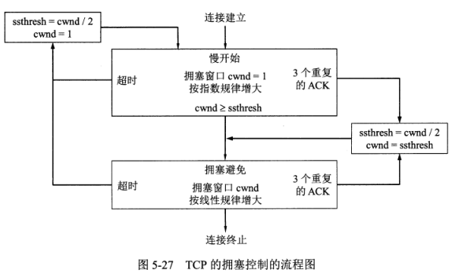
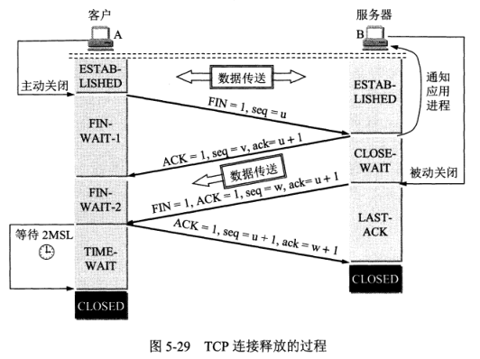
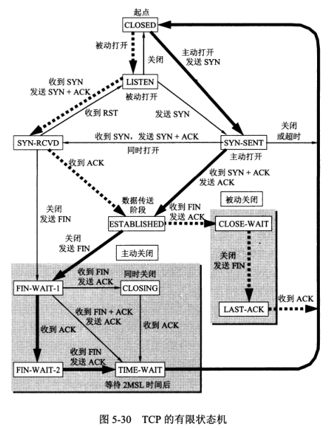

# 《计算机网络》复习笔记

*这个笔记同时使用了两本教材：《计算机网络：自顶向下方法（原书第六版）》和《计算机网络（谢希仁 第七版）》， 目录结构按照自顶向下排列。*

> 日常牢记[Markdown语法](http://wowubuntu.com/markdown/)

## 一、前言：计算机和因特网

### 互联网概述

1. **Internet**两种译名：
   1. **因特网** （小写字母i开头）是一个通用名词，泛指由多个计算机网络互联而成的计算机网络。
   2. **互联网** （大写字母I开头）是一个专用名词，是指当前全球最大的、开放的、由众多网络相互连接而成的特定互联网，采用TCP/IP协议族作为通信规则。 
2. 定义：计算机网络（简称为网络）有若干结点（node）和连接这些结点的链路（link）组成。结点包括计算机、集线器、交换机、路由器等。
3. 互联网是“网络的网络”。网络把许多计算机连接在一起，而互联网则把许多网络通过路由器连接在一起。与网络向量的计算机常称为主机。
4. 区别：计算机网络把许多计算机连接在一起，而互联网则把许多网络连接在一起，是网络的网络。
5. 互联网基础结构发展的三个阶段：
   1. 从ARPANET的产生到互联网络的出现
   2. 建成了三级结构的互联网（主干网、地区网和校园网/企业网）
   3. 建成了多层次ISP结构的互联网。ISP（Internet Service Provider）互联网服务提供商。ISP又分为主干ISP、地区ISP和本地ISP。但他们之间不是严格的树形结构，存在**互联网交换点IXP** （Internet eXchange Point）横向连接
6. 制定互联网标准的三个阶段：
   1. 互联网草案：有效期只有6个月
   2. 建议标准：成为RFC（Request For Comments， 请求评论）文档
   3. ​

### 互联网的组成

1. 边缘部分
   1. 组成：所有连接在互联网上的主机
   2. 通信的主体：主机A的某个进程和主机B的某个进程
   3. 几种通信方式：
      1. C/S方式
      2. P2P方式
2. 核心部分
   1. 组成：网络和连接这些网络的**路由器**。路由器是实现分组交换的关键构建，其任务是转发收到的分组。
   2. 电路交换：通信双方之间分配一条专用的物理通路。
   3. 分组交换：采用**存储转发**技术。把整块数据划分为报文，一步步转发，高效灵活迅速可靠。
3. 计算机在我国的发展：
   1. 中国互联网络信息中心：CNNIC

### 计算机网络的类别

1. 广域网WAN（Wide Area Network）
2. 城域网MAN（Metropolitan Area Network）
3. 局域网LAN（Local Area Network）
4. 个人区域网PAN（Personal Area Network）

### 计算机网络的性能

1. 速率：单位为bit/s， 前缀为K M G T……
2. 带宽：表示某信道允许通过的信号频带范围称为带宽，单位为Hz。在计算机网络中可理解为“最高数据率”
3. 时延
   1. 发送时延 = 数据帧长度(bit) / 发送速率(bit/s)， 含义为从发送数据帧的第一个bit到最后一个bit发送完成所需时间。
   2. 传播时延 = 信道长度(m) / 电磁波在信道上的传播速率(m/s)， 含义为电磁波在信道中传播一定距离所花费的时间，比光速略低。受传输介质物理性质制约，一般无法提高。
   3. 处理时延：主机或路由器收到分组后处理的时间（例如进行差错检验等）
   4. 排队时延：分组在路由器输出队列中排队的时间。
   5. **总时延等于上述四种时延之和**
4. 时延带宽积：时延与带宽的乘积，意义是当第一个bit到达目的地时链路上尚存在多少bit正在传输途中。
5. 往返时间RTT
6. 利用率：

### 计算机网络体系结构

1. 分层的好处：
   1. 各层之间相互独立
   2. 灵活性好
   3. 结构上可分隔开
   4. 易于实现和维护
   5. 能促进标准化工作（主要功能包括以下：）
      1. 差错控制
      2. 流量控制
      3. 分段和重装
      4. 复用和分用
      5. 连接建立和释放

2. 各种体系结构的分层对比

|      | OSI的体系结构 | TCP/IP的体系结构  | 五层协议的体系结构 |
| :--: | :------: | :----------: | :-------: |
|  7   |   应用层    |     应用层      |    应用层    |
|  6   |   表示层    |      ↑       |     ↑     |
|  5   |   会话层    |      ↑       |     ↑     |
|  4   |   运输层    | 运输层（TCP或UDP） |    运输层    |
|  3   |   网络层    |    网际层IP     |    网络层    |
|  2   |  数据链路层   |    网络接口层     |   数据链路层   |
|  1   |   物理层    |      ↑       |    物理层    |

3. OSI参考模型：（OSI/RM, Open Systems Interconnection Reference Model）
   1. OSI并不是事实标准。
   2. OSI是七层协议体系结构。
4. 具有五层协议的体系结构内容：（五层协议是折中OSI和TCP/IP的体系结构）
   1. 应用层（application layer）：任务是通过应用进程间的交互来完成特定网络应用。eg. DNS、HTTP、SMTP
   2. 运输层（transport layer）：任务是负责向两台主机中进程之间的通信提供通用的数据传输服务。主要使用：
      1. TCP（Transmission Control Protocol）传输控制协议：提供面向连接的、可靠的数据传输服务，数据传输单位为**报文段**（segment） 
      2. UDP（User Datagram Protocol）用户数据报协议：提供无连接的、尽最大努力的数据传输服务（不保证数据传输的可靠性），数据传输单位为**用户数据报** 
   3. 网络层（network layer）：负责为分组交换网上的不同主机提供通信服务。使用IP（Internet Protocol）协议，分组也叫**IP数据报** 。
   4. 数据链路层（data link layer）：在两个相邻结点间的链路上传送**帧**（frame）。
   5. 物理层（physical layer）：在物理层上所传数据的单位是bit
5. TCP/IP并不一定是单指TCP和IP两个协议，而往往是表示互联网所使用的TCP/IP协议族。
6. **协议**是控制两个对等实体（或多个实体）进行通信的规则的集合。协议是“**水平的**”，即协议是控制对等实体之间通信的规则。服务是“**垂直的**”，即服务是由下层向上层通过层间接口提供的。上层使用下层所提供的服务必须通过与下层交换一些命令，这些命令在OSI中称为**服务原语**。

## 二、应用层

### 域名系统DNS（Domain Name System）

1. 功能：将互联网上的主机名字转换为IP地址（因为IP地址不好记）
2. 域名中的标号由英文字母和数字组成，每一个标号不超过63个字符，不区分大小写字母，不能使用除连字符“-”外的标点符号。完整的域名不超过255字符。
3. DNS服务器的四种不同类型：
   1. 根域名服务器：知道所有顶级域名服务器的IP地址
   2. 顶级域名服务器：知道注册的所有二级域名的权限域名服务器（例如abc.com和y.abc.com各有一个权限域名服务器）
   3. 本地域名服务器：离用户最近的域名服务器，用户首先会请求本地域名服务器
4. DNS的解析过程：
   1. 递归查询：
   2. 迭代查询：

### 文件传送协议FTP（File Transfer Protocol）

1. FTP工作方式：服务器进程打开21端口接受数据连接，打开20端口接受控制连接
2. FTP与NFS（网络文件系统）的主要区别：FTP无法远程修改文件（只能下载到本地-修改-上传）而NFS可以
3. **简单文件传送协议TFTP（Trivial File Transfer Protocol）** 

### 远程终端协议TELNET

1. TELNET是一个简单的远程终端协议，又称为终端仿真协议。定义了NVT（Network Virtual Terminal， 网络虚拟终端）格式，使用7位ASCII码传送数据，高位置1时用作控制指令。

### 万维网WWW

1. 万维网（World Wide Web）是一个大规模的、联机式的信息储藏所，英文简称为Web。万维网用链接的方法从互联网上的一个站点访问另一个站点。
2. 万维网是一个超媒体（hypermedia）系统，他是超文本（hypertext）系统的扩充。
3. 万维网使用**统一资源定位符URL（Uniform Resource Locator）**来标志万维网上的各种文档。
   1. URL格式：<协议>://<主机>:<端口>/<路径>
   2. 常用协议为HTTP和FTP
   3. 端口号默认为80（可不写）

### 超文本传送协议HTTP 

1. 超文本传送协议HTTP（HyperText Transfer Protocol）是一个应用层协议，使用TCP连接进行可靠的传送。
   1. HTTP是面向事务的应用层协议，使用80端口接受连接。
   2. HTTP是无连接、无状态的，客户端和服务器之间交换HTTP报文前不需要握手，服务器也并不记得客户端是否曾经访问过。
   3. HTTP的历史版本：
      1. HTTP/1.0：不支持持续连接，每个连接仅传送一个文件
      2. HTTP/1.1：加入了持续连接，支持流水线方式和非流水线方式（所谓流水线，是指客户不用等待前一个响应的到来就可以发出下一个请求，而非流水线则需要每次收到响应之后才能发出下一个请求）
   4. 代理服务器（proxy server）：

2. HTTP报文结构：

   1. 开始行：用于区分是请求报文还是响应报文。在请求报文中叫做请求行，在响应报文中叫做状态行。开始行三个字段之间用空格分开，结尾为CR（回车）和LF（换行）
      1. 请求行：包括方法、URL、版本
      2. 响应行：包括版本、状态码、短语
   2. 首部行：用来说明浏览器、服务器或报文主体的一些信息，可以不止一行。
   3. 实体主体（entity body，也叫实体体）：请求报文一般不用，响应报文中很可能没有这个字段

3. HTTP方法：
   1. OPTION：请求一些选项的信息
   2. GET：请求读取由URL所标志的信息
   3. HEAD：请求读取由URL所标志的信息的首部
   4. POST：给服务器添加信息
   5. PUT：在指明的URL下存储一个文档
   6. DELETE：删除指明的URL所标志的资源
   7. TRACE：用来进行环回测试的请求报文
   8. CONNECT：用于代理服务器

4. HTTP响应报文的状态码：三位数字

   1. 1xx表示通知信息，如请求收到了或正在进行处理

   2. 2xx表示成功，如接受或知道了。常见：202 Accepted

   3. 3xx表示重定向，如要完成请求还必须采取进一步的行动

   4. 4xx表示客户的差错，如请求中的错误的语法或不能完成。

      常见：400 Bad Request； 404 Not Found

   5. 5xx表示服务器的差错，如服务器失效无法完成请求

5. 例：HTTP请求报文

   GET /dir/index/htm HTTP/1.1		开始行：方法为GET，使用相对URL，HTTP版本为1.1

   Host: www.xyz.edu.cn				首部行：给出了主机域名

   Connection: close				首部行：告诉服务器发送完请求的文档之后就可以释放链接

   User-Agent: Mozilla/5.0			首部行：表示用户代理是使用火狐浏览器Firefox

   Accept-Language: cn				首部行：表示用户希望优先得到中文版本的文档

   ​								空行：请求报文的最后还有一个空行

6. 在服务器上存放用户的信息：服务器在响应报文中给客户端分配一个Cookie作为其识别码

7. 超文本标记语言HTML（HyperText Markup Language）

### 电子邮件

- 电子邮件系统的组成：

1. 用户代理UA（User Agent）：用户与电子邮件系统的接口，又称为电子邮件客户端软件。具备以下四个功能：
   1. 撰写
   2. 显示
   3. 处理（包括发送邮件和接收邮件）
   4. 通信（将邮件发给邮件服务器或是从邮件服务器取回邮件）
2. 邮件服务器
   1. 邮件从发件人的邮件服务器到收件人的邮件服务器是直达的（两台服务器之间直接通过TCP连接），不经过任何中转。
3. 邮件发送协议和邮件读取协议

#### 简单邮件传送协议SMTP（Simple Mail Transfer Protocol） 

1. 是一个邮件发送协议，仅支持传送可打印的7位ASCII码邮件。SMTP把邮件“**推**”给服务器。
2. SMTP使用端口号为25
3. 使用场景：用户代理将邮件发送给邮件服务器，邮件服务器将邮件发送给目标用户的邮件服务器。
4. 缺点：
   1. 发件人的地址不需要经过鉴别
   2. 设计为只传输ASCII码而不是二进制数据（如需传输二进制数据则要编码为7字节的ASCII码）
   3. 传送邮件为明文
   4. SMTP服务器会拒绝超过一定长度的邮件
   5. 产生扩充的SMTP：“**ESMTP**“ 

#### 通用互联网邮件扩充MIME（Multipurpose Internet Mail Extensions）

1. 在现有的电子邮件程序和协议下传送，但增加了邮件主体的结构，并定义了传送非ASCII码的编码规则。（个人理解相当于在SMTP上加了一个表示层）
2. 在邮件首部说明邮件的数据类型，可以发送文本、声音、图像、视频等数据。
3. 对于任意的二进制文件，使用base64编码

#### 邮局协议POP3（Post Office Protocol）第三版 

1. 是一个邮件读取协议，仅支持将邮件从服务器“**拉**”回来 （拉完服务器就删除邮件了）
2. 使用场景：用户代理从邮件服务器那里取回自己的邮件。

#### 网际报文存取协议IMAP（Internet Message Access Protocol）第四版 

1. 是一个联机协议，客户端通过IMAP可以操纵邮件服务器的邮箱，最大特点是支持多客户端访问邮箱。

### 动态主机配置协议DHCP（Dynamic Host Configuration Protocol）

1. 服务器端使用UDP 67端口，客户端使用UDP 68端口。

2. 提供的机制：即插即用连网（Plug-and-Play networking）

3. 配置的内容：IP地址、子网掩码、默认路由器的IP地址、域名服务器的IP地址

4. 使用方法：
      1. 客户端主机接入网络，向DHCP发送一个**发现报文**（0.0.0.0:68 to 255.255.255.255:67）
      2. DHCP服务器接到报文，发出一个回答报文叫做“**提供报文**”（server IP:67 to 255.255.255.255:68）,提供具有一定租用期T的IP地址（在网络内DHCP服务器可能不止一个）
      3. 客户端挑选一个DHCP提供者，向其发送DHCP**请求报文**（0.0.0.0:68 to server IP:67），请求其作为提供者
      4. 该DHCP服务器回复**确认报文**（server IP:67 to 255.255.255.255:68），告知客户端可以使用其分配的IP地址，这种状态叫做已绑定状态。 
      5. 之后客户端就可以使用该IP地址了。客户端维护两个计时器T1和T2（T1 = 0.5T， T2 = 0.875T），计时器到之后DHCP客户端请求DHCP服务器要求更新租用期。
      6. 若DHCP服务器同意更新，则返回新的确认报文，客户端更新计时器；若DHCP不同意，则返回**否认报文**，这时DHCP客户端必须立即停用原来的IP地址，返回步骤1重新申请。
      7. DHCP客户可以随时终止租用，只需向DHCP服务器发送**释放报文**。 

### 简单网络管理协议SNMP 

这一部分貌似没有学过，在谢希仁书297页

## 三、运输层

###运输层概述

1. 运输层为相互通信的应用进程提供逻辑通信
2. 运输层提供复用和分用（IP也提供）
3. 运输层提供差错检测（UDP仅提供检验和）
4. 运输层的两个协议：
   1. 传输控制协议TCP（Transmission Control Protocol），提供面向连接的、全双工的可靠信道。传输数据的单位为报文段（segment）
   2. 用户数据报协议UDP（User Datagram Protocol），提供无连接的、不可靠的信道。传输数据的单位为数据报（datagram）
   3. *流控制传输协议SCTP（Stream Control Transmission Protocol）不常用
5. UDP承载的常见应用层协议：[熟知端口号列表（维基百科）](https://zh.wikipedia.org/wiki/TCP/UDP%E7%AB%AF%E5%8F%A3%E5%88%97%E8%A1%A8)
   1. 名字转换：DNS（域名系统）端口53（DNS也可能使用TCP）
   2. 文件传送：TFTP（简单文件传送协议）端口69
   3. 路由选择协议：RIP（路由信息协议）端口520
   4. IP地址配置：DHCP（动态主机配置协议）服务器：67，客户端：68，DHCPv6客户端：546，DHCPv6服务器：547
   5. 网络管理：SNMP（简单网络管理协议）端口161
   6. 远程文件服务器：NFS（网络文件系统）
   7. 多播：IGMP（网际组管理协议）
6. TCP承载的常见应用层协议：
   1. 电子邮件：
      1. STMP（简单邮件传送协议）端口25
      2. IMAP4（网际报文存取协议第四版）端口143
      3. POP3（邮局协议第三版）端口110
   2. 远程终端接入：TELNET（远程终端协议）端口23
   3. 万维网：HTTP（超文本传送协议）端口80
   4. 文件传送：FTP（文件传送协议）数据：20，控制：21
   5. 远程登录：SSH（Secure Shell）端口：22

### 用户数据报协议UDP

1. UDP的特点
   1. 仅在IP的数据报服务之上增加了复用和分用的功能以及差错检测的功能（详见UDP报文头部）
   2. 无连接的：发送数据之前不需要建立连接，发送之后也不需要释放
   3. 使用尽最大努力交付：即不保证可靠交付，主机不需要维持复杂的连接状态
   4. 面向报文的：UDP对应用层传来的报文，既不合并，也不拆分，一次交付一个完整报文（若过长，则由IP层对其进行分片）
   5. 没有拥塞控制：一方面会导致不可预测的丢包，另一方面也可以用于绕过TCP的拥塞控制机制而确保低时延
   6. 即可以点对点传送，也可以广播（目的IP地址为255.255.255.255）或多播（目的IP地址为D类组播地址，利用IGMP协议）
2. UDP的首部格式：总长8字节
   1. 源端口（2字节）：在需要对方回信时选用，不需要时可用全0
   2. 目的端口（2字节）：接收方如果发现端口号不正确，则返回一个ICMP不可达报文给发送方
   3. 长度（2字节）：最小为8（仅有头部），最大寻址为64KB，也是UDP报文最大长度（65536 - 8 = 65528 Bytes）
   4. 检验和（2字节）：计算时会在报文前加一个**伪首部**，内容包括：源IP地址（4字节）、目的IP地址（4字节）、0（1字节，不知道是什么含义）、17（1字节，17是IP首部中协议字段的值）、UDP长度（2字节，内容与真首部的长度相同）

### 可靠传输的工作原理

1. 这里谢书写的不好，等待用自顶向下书补充

### 传输控制协议TCP

####TCP的特点 

1. 面向连接的协议：使用之前先建立连接，传输完成之后必须释放连接
2. 点对点的：
3. 提供全双工通信：
4. 面向字节流：TCP将上层交付的数据仅仅看成是一连串的无结构的字节流
5. 每条TCP连接唯一地被通信两端的两个端点（即两个套接字）所确定。

####TCP报文段的首部格式

（首部是**可变长**的，前20字节是固定的，后面可以有选项（按32位对齐））

1. 源端口和目的端口：各占2字节

2. 序号（Seq）：4字节，可寻址4GB。TCP传送的字节流中的每一个字节都按顺序编号，首部中的序号字段指的是本报文段所发送数据的第一个字节的序号。

3. 确认号（Ack）：4字节，可寻址4GB。是期望收到对方下一个报文段的第一个数据字节的序号（例如A向B发送的msgA1的字节序号为1~200，则B向A发出的报文msgB1的Ack值为201）。若确认号为N，则表示到序号N-1为止的所有数据都已正确收到。

4. 数据偏移：4位（0.5字节），表明TCP报文段的数据起始处距离TCP报文段的起始处有多远（实际上该字段指出的是头部长度，但偏移单位为32位，也就是说头部每32字节，数据偏移加1），4bit可以寻址15*4 = 60字节的头部长度（因此TCP首部最短20字节，最长60字节）

5. 保留：6位（0.75字节），暂时没有用到，目前置0

6. flag（flag是自己起的名称，并非官方用词）：6位（0.75字节）

   1. URG（URGent）：紧急指针标志，告诉系统此报文含紧急数据，与紧急指针字段配合使用。
   2. ACK（ACKnowledgement）：确认标志，连接建立之后所有传送的报文段都必须把ACK置1
   3. PSH（PuSH）：推送标志，在交互式通信中发送进程希望可以立即发送而不是等待缓存都填满了之后再发，于是发送端接收到上层的数据之后立即发送出去，接收端收到数据之后也立即交给上一层调用
   4. RST（ReSeT）：复位标志，表明TCP连接中出现严重错误，必须立即释放连接。还用于拒绝一个非法的报文段或拒绝打开一个连接。
   5. SYN（SYNchronization）：同步标志，在连接建立时用来同步序号。当SYN=1而ACK=0时，表明这是一个连接请求报文段（第一次握手），对方若同意建立连接，则响应SYN=1和ACK=1（第二次握手）。
   6. FIN（FINish）：终止标志，用来释放一个连接。

7. 窗口：2字节。窗口的含义是发送方A的接收窗口（而不是发送窗口）。窗口值表明：从本报文段首部的确认号算起，发送方A所允许对方B发送给A的数据量。（例如A发给B的msg1中，Ack=701，窗口=1000，表明A这里的接收缓存空间还剩1000个字节的空余，则B应当只能发Seq为701-1700的数据）。窗口值是动态变化的。

8. 检验和：2字节。检验和的计算方法同UDP一样要加一个伪首部，12字节，包括4字节的源IP地址、4字节的目的IP地址、1字节的数字0、1字节的协议号（TCP为6，UDP为17）、2字节的TCP长度（和TCP真头部的长度值相同）

9. 紧急指针：2字节。紧急指针仅在URG=1时有意义，它指出本报文段中的紧急数据的字节数（紧急数据之后是普通数据），也就是指出紧急数据的末尾在报文段的位置。PS. 即使窗口为0也可以发送紧急数据。

10. 选项。长度可变，0~40个字节都可以，包含选项内容时需要填充对齐到32位。当选项未使用时头部长为20字节。常见选项：

  1. 最大报文段长度MSS（Maximum Segment Size）选项：表明每一个TCP报文段中数据字段的最大长度（再一次提醒，只含数据，不含头部）。该字段的目的是使TCP单个报文段携带尽可能多的数据，但又不至于报文段大到使IP层将其分片传输，以提高效率。然而不同路由支持的MSS可能不同，因此通信双方各自设置自己能够支持的MSS（两个传送方向可以有不同的MSS）。若双方未填写，则MSS默认值为536字节。因此互联网上所有的设备都应该能接受的报文段长度为536+20=576字节。
  2. 窗口扩大选项：3字节。TCP首部中的16位窗口字段寻址能力为64KB，可能不够用（例如对于卫星通信而言传播时延和带宽都很大，需要更大的窗口，这种信道又被称为长粗管道long fat pipe），窗口扩大选项其中有一个字节表示**移位值S**，新的窗口值等于TCP首部中的窗口位数从16增到到16+S，移位值S允许的最大值为14，因此窗口最大值为2^30-1。窗口扩大选项可以在TCP连接建立时协商，如果某一段实现了窗口扩大，当其不再需要窗口扩大时可发送S=0，使窗口回到16位。
  3. 时间戳选项：10字节，包含时间戳值字段（4字节）和时间戳回送回答字段（4字节），其功能为：

     1. 计算往返时间RTT：发送方将当前时间放入时间戳字段，接收方在确认该报文段时把时间戳字段值复制到时间戳回送回答字段中，当发送方收到确认报文之后便可准确计算出RTT。
     2. 用于处理TCP序号超过2^32的情况，又称为**防止序号绕回PAWS**（Protect Against Wrapped Sequence numbers）。例如以2.5Gbps速率发送数据时，不到14秒序号就会重复。为了使接收方可以区分新的报文段和迟到很久的报文段，需要这种时间戳。（事实证明，设计协议时极端的、看似不可能的情况也需要考虑进去，毕竟TCP设计之初全世界所有的网络加起来也达不到这么高的速率）
  4. 选择确认（SACK）选项：背景：连续传送的报文段，中间丢掉了几个，因此接收方只确认到最后一次正确收到的那里（丢失的部分之后正确接收的数据也在缓存中放着，因为Seq可以指出它们的正确位置），于是发送方就要按照接收方的ACK指出的位置开始重新开始传输，但断片的毕竟是少数，因此本选项的目的是：让发送方只传送缺少的数据而不重传已经正确到达的数据，即告诉发送方“这一段我已经收到了，你不要再发了”。一个典型的SACK选项包括：1字节指明这是SACK选项字段、1字节表明SACK选项字段的长度、4个字节的起始边界、4个字节的结束边界（起始边界和结束边界的值为这一段数据的ACK值。起始边界和结束边界成对存在，最多5对边界，否则会超出40字节的选项字段容量）。然而SACK文档并没有指明发送方应当怎样响应SACK，因此大多数的实现还是重传**所有**未被确认的数据块（略坑……）。

####TCP可靠传输的实现

发送方有一个发送窗口，接收方有一个接收窗口，这两个窗口的作用是缓存当前正在传输的数据。

1. 发送窗口：

   1. 发送窗口的大小是根据接收方发来的报文段中首部规定的接收窗口设置，但有时也会小于这个值（受拥塞控制的制约）。发送窗口越大，表明接收方可以一次性确认更多的数据，因此可以提高传输效率。
   2. 发送窗口内存放的是可以发送但尚未被确认收到的数据。
   3. 发送窗口之后的数据全部被确认收到（因此发送窗口不再保留），发送窗口内的数据为允许发送的，发送窗口之前的数据为不允许发送的（因为接收方并没有更多的缓存存放，换言之就是一定会丢失）
   4. 发送窗口内的数据发送完成之后需要等待确认，因此如果没有被确认，则发送窗口不能向前移动，收到确认则可以向前移动到未确认的第一个序号处。
   5. 发送窗口后沿不能向后移动（因为不能撤销已收到的确认），前沿可以向前移动（窗口扩大或窗口前移），可以向后收缩（但TCP标准**强烈不赞成这样做**）。
   6. 发送窗口可以分为两部分：后面一部分为已发送但未收到确认的，前面一部分为允许发送但尚未发送的（也叫可用窗口或有效窗口）。发送方用完可用窗口之后就要停下来等待确认，如果确认超时则要从发送窗口后沿开始重传。

2. 接收窗口：

   1. 接收窗口的大小由套接字自己决定，受拥塞控制的制约。
   2. 接收窗口内存放的是已收到的、但尚未交付上层的数据（因为不是连续的）。
   3. 接收窗口之后的数据全部发送确认（因此接收窗口不再保留），接收窗口内的数据为暂未确认的，接收窗口之前的数据为不允许接收的（因为这部分并没有缓存可存放，换言之就是直接丢弃）
   4. 接收窗口内的数据一旦连续了，则可以发出一个确认信息，并将接收窗口前移。接收窗口如果未达到确认条件则一直不移动也不发出确认，造成超时则由发送方重传。（或是发送三个相同的ACK隐式表示NAK）
   5. 接收窗口后沿不能向后移动（因为不能撤销已收到的确认），前沿可以向前移动（窗口扩大或窗口前移），可以向后收缩（但TCP标准**强烈不赞成这样做**）
   6. TCP要求接收方必须有累积确认的功能，这样可以减少传输开销。接收方不应过分推迟确认，否则会导致发送方不必要的重传（规定不超过0.5秒）

3. 超时重传时间的选择

   1. 往返时间RTT：

      报文段的往返时间。通过TCP的首部选项字段设置的时间戳完成计算。

   2. 加权平均往返时间RTTs的计算：

      TCP保留了RTT的一个**加权平均往返时间RTTs**（又称平滑往返时间，S表示Smoothed）。RTTs的计算方法为：

      **新的RTTs = （1 - α） × （旧的RTTs）+ α × （新的RTT样本）**

      α的推荐值为0.125，当第一次测量时，RTTs的取值即为RTT的值。

      这个公式的含义是，每测算出一个RTT就将其作为八分之一的权重生成新的加权平均值。越新的数据对RTTs的影响越大。

   3. 偏差加权平均往返时间RTTd的计算：（PS. RTTd中的d应当为下标的大写D，因为Markdown的限制无法写出）

      RTTd表示RTT的偏差的加权平均值，它与RTTs和新的RTT样本之差有关。计算方法为：

      **新的RTTd = （1 - β） × （旧的RTTd）+ β × |RTTs - 新的RTT样本|**

      β的推荐值为0.25，当第一次测量时，RTTd的取值应为测量到的RTT样本值的一半。

      这个公式的含义是，每测算出一个RTT，将其与RTTs的差（的绝对值）作为四分之一权重生成新的偏差加权平均值。因此RTTd刻画了RTT的波动大小，且越新的数据对RTTd影响越大。

   4. 超时重传时间RTO（Retransmission Time-Out）应当略大于上面得出的RTTs。TRO计算方法如下：

      **TRO = RTTs + 4 × RTTd**

      这个公式的含义是，超时重传时间是在加权平均往返时间的基础上，加上四倍的偏差加权平均往返时间。

   5. RTO存在的问题：发送方发出msg1，达到超时重传时间仍然没有收到确认，这时发送方重传msg1'，又过了不超过RTO的时间收到了确认，那么这个确认是接收方对msg1的确认还是msg1'的确认？。

      也就是说，发送方和接收方均无法区分这两种情况：情况一是接收方收到了msg1并对msg1进行确认，但此时发送方已经重传，确认报文在重传之后才到达发送方；情况二是msg1在路上丢失，后来发送方重传，接收方收到了msg1‘，并对其进行确认。这两种方法都会导致计算出的RTTs和RTO偏差过大。

      TCP采用这样的方法解决：**在计算加权平均RTTs时，只要报文段重传了，就不采用其往返时间样本。**

      但这样无法解决RTT突然增大很多的情况（即此时RTT增大不是偶发性的而是持续性的），按照上述方法将无法永远更新RTO。

      修正方法：**报文段每重传一次，就把RTO增大为原来的2倍，直到不发生重传时再回到原来的计算方式。**

####TCP的流量控制

流量控制的目的：让发送方的发送速率不要太快，要让接收方来得及接收。

1. 利用滑动窗口实现流量控制：

   1. 发送方发送窗口不能超过接收方给出的接收窗口。接收方可能将窗口值设为0（即使设置为0，也必须要接收以下几种报文段：零窗口探测报文段、确认报文段和携带紧急数据的报文段）
   2. TCP每一个连接都有一个**持续计时器**（在接收方设置接收窗口为0时启动），若时间到了则发送一个**零窗口探测报文段**（仅携带1字节数据），对方在确认中给出现在的接收窗口值。

2. TCP的传输效率

   1. TCP报文段的发送时机：
      1. 缓存的数据量大于最大报文段长度MSS（意味着数据可以装满一个报文段了，取出并发送之）
      2. 发送方的应用进程知名要求发送报文段（即TCP支持的推送PUSH操作）
      3. 发送方的一个计时器期限到了，就把缓存中的数据（不大于MSS，否则执行条件1）发送出去

   - 如果是每次都发送小的报文段（例如TELNET，报文段的数据部分甚至短于首部），则要用到以下两种算法：

   1. Nagle算法：
      1. 如果数据是逐个字节写入缓存的，则发送方把第一个字节立即发出去，后面到达的字节缓存起来；
      2. 当发送方收到第一个字节的确认之后，再将发送缓存中的所有数据发送出去，在此之后到达的字节继续缓存起来
      3. 只有收到对前一个报文段的确认之后才继续发送下一个报文段
      4. 当待发送的数据已达到发送窗口的一般或已达到MSS时，就立即发送一个报文段
      5. Nagle在上层交付数据较快而网速较慢的情况下可以明显减少所用的网络带宽。
   2. 糊涂窗口综合征（silly window syndrome）：（其实我也被搞糊涂了，这些讲了个啥子喃？）
      1. 表现：接收方缓存已满，上层应用一次只从接收缓存中取走很少的数据（例如1字节），在确认中设置的窗口也很小（例如1字节），性能极低。
      2. 解决办法：接收方等待一段时间，直到缓存可以容纳下一个最长的报文段，或是缓存已有一半空闲的空间。出现这两种情况之一则接收方可以发出确认报文，并设置窗口大小。此外，发送方也不要发送太小的报文段，而是把数据累积成足够大的报文段，或是达到接收方缓存的一半大小。
      3. 简而言之，就是不要太着急发送小段的数据。

#### 拥塞控制原理

1. 拥塞控制的一般原理：
   1. 拥塞产生的条件：网络资源有限，若对网络中某一资源的需求超过了该资源所能提供的可用部分，网络的性能就要变坏。
   2. 拥塞是一个多因素的、系统性的问题：如果将资源中的某一部分提高容量，并不会改善整个系统的拥塞程度，反而会增大对其他资源的需求，或是造成自身资源的严重浪费。
   3. 拥塞常常趋于恶化：下层链路拥塞会导致上层重传，正反馈机制最终导致系统崩溃。
   4. 拥塞控制是一个动态的问题，是一个全局性的过程。
2. 流量控制：指点对点通信中对通信量的控制，是一个端到端的问题，流量控制所要做的是抑制发送端发送数据的速率，以便接收端来得及接收。（有时发送端的最高发送速率远远高于接收端的最高接收速率，甚至是高于网络本身能够承载的最高传输速率，例如大型服务器向普通个人计算机传送数据，这时就需要限制发送方的发送速率）
3. 拥塞控制和流量控制的差别：
   1. 拥塞控制的目的是防止过多数据注入到网络中，这样可以使网络中的路由器或链路不致过载。而流量控制的目的是抑制端到端发送数据的速率。
   2. 拥塞控制所要做的都只有一个前提：网络能够承受现有的网络负荷。
   3. 拥塞控制是一个全局性的过程，而流量控制仅限于通信的两端。
4. 拥塞控制和流量控制的相似性：都是向发送端发送控制报文，告诉发送端让其放慢发送速率。
5. 解决拥塞控制的原理：寻找使拥塞产生的条件不再满足的方法。
   1. 增大某些可用资源（增加一些链路，增大带宽等）
   2. 减少一些用户对某些资源的需求（例如拒绝新的建立连接的请求）
   3. 其他……
6. 拥塞控制的方法：**开环控制**和**闭环控制**
7. 监测网络拥塞的指标：
   1. 由于缺少缓存空间而被丢弃的分组的百分数
   2. 平均队列长度
   3. 超时重传的分组书
   4. 平均分组时延
   5. 分组时延的标准差
   6. 其他……

#### TCP的拥塞控制方法

- TCP的拥塞控制算法有四种，分别是慢开始、拥塞避免、快重传、快恢复。其中，慢开始和拥塞避免也叫做**基于窗口**的拥塞控制。发送方维持一个叫做**拥塞窗口cwnd**（congestion window）的状态变量。拥塞窗口的大小取决于网络的拥塞程度，并且动态地在变化。**发送方让自己的发送窗口等于拥塞窗口**。
- 发送方控制拥塞窗口的原则：只要网络没有出现拥塞，拥塞窗口就可以再增大一些。但只要网络出现拥塞或有可能出现拥塞，就必须把拥塞窗口减小一些。
- 发送方判断网络拥塞的依据：没有按时收到确认报文。这是基于网络拥塞会导致报文的丢失或超时这一事实。

1. 慢开始（slow-start）：
  1. 原理：发送数据时由小到大逐渐增大发送窗口（拥塞窗口）的数值

  2. 拥塞窗口的初始值设置：1~2个发送方的最大报文段SMSS（Sender Maximum Segment Size）的值（旧规定），新规定为不超过2~4个SMSS的数值。

  3. 增加值的规定：**拥塞窗口每次的增加量 = min(N，SMSS)**

     其中N是原先未被确认的、但现在被刚收到的确认报文段所确认的字节数。因此，当N < SMSS时，拥塞窗口每次的增加量要小于SMSS。 （个人理解：慢开始的目的是尽快找到一个平衡点，这个平衡点附近的拥塞窗口刚好满足接收方尽可能少地确认，且发送方尽可能一次多发送一批数据。若每次增加N，则表示接收方至少具有容纳这N个字节的能力，若每次增加SMSS，则表示还是保守一点，每次只增加一个报文段的量）

  4. 事实上的表现：2的指数增长形式，因为每一次发送都会收到等量的确认，于是下一次发送的量就是本次发送量的两倍（前期忽略拥塞，因为此时网络还未达到拥塞的程度）

  5. 慢开始的“慢”并不是指拥塞窗口的增长率慢，而是指在TCP开始发送报文段时先设置一个很小的拥塞窗口，使得发送方在开始时只发送一两个报文段以探测网络的拥塞情况，然后再逐渐增大拥塞窗口。

  6. **慢开始门限（ssthresh）**状态变量：为了方式拥塞窗口增长过大引起网络拥塞，因此当拥塞窗口超过这个慢开始门限之后改用拥塞避免算法。 

2. 拥塞避免（congestion avoidance）：

   1. 思路：让拥塞窗口缓慢增大。具体措施是：每经过一个RTT就把发送方的拥塞窗口+1（加法增大 Additive Increase）。拥塞窗口按线性规律缓慢增长。
   2. 转变：当第一次遇到超时时，拥塞窗口减到1个MSS，慢开始门限也减到拥塞窗口的一半（刚刚发生超时时的窗口值的一半），于是回到慢开始阶段。

3. 快重传（fast retransmit）：

   1. 发生时机：接收方对一个相同的报文段确认三次。
   2. 发送方如何处置：立即重传丢失的那个报文段。
   3. 改变：接收方原先收到失序的报文段什么也不做，现在需要用重新确认已收到的报文段提醒发送方。
   4. 快重传的优势：只需要重新发送没收到的报文段，发送方也不会误认为出现了网络拥塞。使用快重传可以使整个网络的吞吐量提高约20%。

4. 快恢复（fast recovery）：

   1. 跟快重传同时开始。
   2. 内容：发送方将慢开始门限减到拥塞窗口的一半，将拥塞窗口也减半，并开始执行拥塞避免算法。
   3. 有的快恢复实现是将快恢复开始时的拥塞窗口设置为慢开始门限ssthresh + 3 × MSS的长度，这样做的理由是：发接收方发出了三个ACK，则表明有三个失序的分组已经到达接收方的缓存中，因此网络中并没有堆积三个分组，所以可以适当把拥塞窗口扩大些。

5. 四种算法的统一描述：

   1. 传输开始时进入**慢开始**阶段，拥塞窗口从1（或者是不大于4）开始倍增

   2. 发送速率达到慢开始门限，拥塞窗口以及发送速率从指数增长变为线性增长，进入**拥塞避免**阶段 

   3. 遇到超时，慢开始门限值减为当前发送速率的一半，拥塞窗口减为1，进入慢开始阶段；

   4. 遇到三个相同的ACK，执行**快重传**算法，立即发送未确认的那个报文段，并将慢开始门限值减为当前发送速率的一般，拥塞窗口也同样减为当前发送速率的一半，发送速率线性增长，进入**快恢复**阶段。 

   5. 在拥塞避免阶段，拥塞窗口是“**加法增大**”AI（Additive Increase）的，而一旦出现超时或三个重复的ACK，就要把慢开始门限值设置为当前拥塞窗口值的一半，并大大减小拥塞窗口的数值，这称为“**乘法减小**”MD（Multiplicative Decrease），二者合称为AIMD算法。

      

   6. 接收方窗口又称为通知窗口（advertised window），从接收方对发送方的流量控制的角度考虑，**发送方得发送窗口一定不能超过对方给出的接收方窗口值rwnd**。但事实上发送方窗口值不仅受接收方窗口值的约束，还受拥塞窗口cwnd的约束，因此发送方窗口的上限值为：

      **发送方窗口的上限值 = min(rwnd, cwnd)** 

   7. 主动队列管理AQM

      1. 路由器的队列规则：先进先出FIFO（First In First Out），队列已满则丢弃以后再到达的分组，叫做**尾部丢弃策略**。

      2. **全局同步**现象：路由器的队列中有承载着来自不同TCP连接的报文段的IP分组，简单的丢弃会导致多个TCP连接进入慢开始状态，于是全网通信量急剧下降，尔后通信量又突然增大许多。

      3. 主动队列管理原理：不必等到队列已满，在早期就主动丢弃一些到达的分组。通常是在队列已经达到某个值得警惕的数值是就主动丢弃到达的分组，这样可以使发送方提前降低发送速率。

      4. AQM的一种早期实现方法：**随机早期检测RED**（Random Early Detection）：

         实现RED需要路由器维护两个参数，最小门限和最大门限。

         1. 队列长度小于最小门限：正常运行
         2. 队列长度大于最小门限，但不大于最大门限：以概率p随机丢弃新到达的分组
         3. 队列长度大于最大门限：丢弃所有新到达的分组

      5. RED的丢弃概率p难以确定。RED在2015年之后已被淘汰。但AQM技术仍然是必要的。

#### TCP的运输连接管理

TCP是面向连接的协议。TCP连接采用C/S模式。

1. TCP的连接建立：三次握手

   1. 第一次握手：C向S发送。同步位SYN = 1，选择一个Seq = x。TCP规定SYN报文段不携带数据，但要消耗掉一个Seq序号。此时进入**SYN-SENT**（同步已发送）状态。
   2. 第二次握手：S向C发送。如果S同意连接，则同步位SYN = 1， ACK = 1， 选择一个Seq = y， 确认号Ack = x + 1。TCP规定SYN-ACK报文段不携带数据，但要消耗掉一个Seq序号。此时进入**SYN-RCVD**（同步收到）状态。
   3. 第三次握手：C向S发送。同步位取消，ACK = 1（ACK在整个传输生命期内都要为1），Seq = x + 1， Ack = y + 1,。第三次握手可以携带数据，也可以不携带数据。不携带数据则不消耗Seq序号（也就是下一次发送时序号还是Seq = x + 1）。此时C进入**ESTABLISHED**（已建立连接）状态。

2. TCP的连接释放：

   

   1. 前提：C和S都处于ESTABLISHED状态。
   2. 第一次握手：C向S发送。（ACK = 0）终止控制位FIN = 1， 需要Seq = u（u等于前面传送完成的最后一个字节的序号+1）。TCP规定FIN报文段即使不携带数据，也要消耗掉一个Seq序号。此时C进入**FIN-WAIT-1**（终止等待1）状态。
   3. 第二次握手：S向C发送。ACK = 1，Seq = v（含义同u），Ack = u + 1。此时S进入**CLOCE-WAIT**（关闭等待）状态。此时从C到S的连接释放，TCP连接处于**半关闭**（half-close）状态，但另一个方向的连接尚未释放，S还可以给C发送数据。
   4. C收到S的确认之后，进入**FIN-WAIT-2**（终止等待2）状态，等待S发出连接释放报文段。
   5. 若S再无数据发给C，则S向C发送连接释放报文段，FIN = 1，ACK = 1， Seq = w（含义同u），Ack = u + 1。此时S进入**LAST-ACK**（最后确认）状态，等待C确认。
   6. C必须确认S的这一报文段。ACK = 1，Ack = w + 1，Seq = u + 1。此时C进入**TIME-WAIT**（时间等待）状态。此时连接尚未释放完成，需要经过**时间等待计时器**（TIME-WAIT timer）设置的时间2MSL（最长报文段寿命Maximum Segment Lifetime，建议为2分钟）之后才能进入CLOSED状态。

3. 保活计时器（keepalive timer）

   1. ​

4. TCP的有限状态机

   

## 四、网络层

## 五、链路层

## 六、物理层

## 七、无线网络和移动网络

## 八、多媒体网络

## 九、网络安全

# 附：《计算机网络（第七版）》（谢希仁著）的课后作业

1-01 计算机网络可以向用户提供端对端的传输服务，可以是面向连接的、可靠的服务（TCP），也可以是无连接的、不可靠的尽力而为的服务（UDP）。

1-02 分组交换的要点：暂时未写

1-03 各自的优缺点：未填完 

|      |    优点     |           缺点            |
| :--: | :-------: | :---------------------: |
| 电路交换 | 速度快，传输无延迟 | 效率低，建立交换需要时间，使用完毕需要拆除连接 |
| 报文交换 |           |                         |
| 分组交换 |           |                         |

